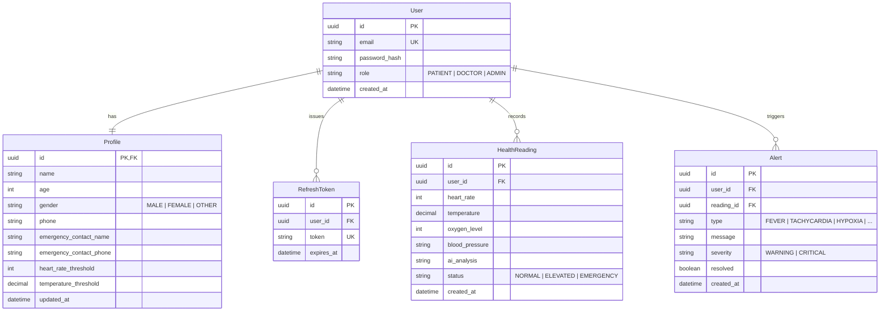

# PulseCare AI — Clinical Health Monitoring Platform

PulseCare AI is a next-generation real-time health telemetry monitoring platform. It collects vitals data from wearable sensors or simulators, evaluates anomalies via an Emergency Detection Engine, alerts designated caregivers through SMS/emails, and provides patients with conversational symptom triage using Google Gemini AI.

---

## System Architecture

```mermaid
graph TD
    subgraph Client Layer (React SPA)
        Dashboard[Dashboard Card Widgets]
        ECG[Scrolling Telemetry Graph]
        Triage[AI Chat Interface]
        AlertCenter[Alert Resolved Center]
    end

    subgraph Transport Layer
        HTTP[REST APIs - fetch]
        WS[Socket.IO Client WebSocket]
    end

    subgraph Service Backend (Express + TS)
        Router[Router & Middleware]
        EE[Emergency Engine]
        WS_Serv[WebSocket Server]
        Notify[Notification Service]
        Gemini[Gemini AI / Fallback Triage]
        Prisma[Prisma ORM Client]
    end

    subgraph Database
        DB[(SQLite / PostgreSQL)]
    end

    Dashboard --> HTTP
    ECG -.-> WS
    Triage --> HTTP
    AlertCenter --> HTTP

    HTTP --> Router
    WS -.-> WS_Serv

    Router --> EE
    EE --> Prisma
    EE --> Notify
    Router --> Gemini
    WS_Serv --> EE

    Prisma --> DB
```

---

## Database Schema (ERD)



---

## API Documentation

All API routes start with `/api`. Protected routes require a JWT access token in the headers as:
`Authorization: Bearer <access_token>`

### 1. Authentication
* `POST /auth/signup` - Registers user and sets up profile.
  - Body: `{ email, password, name, age, gender, phone, emergencyContactName, emergencyContactPhone }`
* `POST /auth/login` - Signs in and returns tokens.
  - Body: `{ email, password }`
  - Response: `{ accessToken, refreshToken, user: { id, email, role, name } }`
* `POST /auth/logout` - Revokes refresh token.
  - Body: `{ refreshToken }`
* `POST /auth/refresh` - Rotates refresh tokens and access token.
  - Body: `{ refreshToken }`

### 2. Vitals & IoT Ingestion
* `POST /vitals` - Manual vitals ingestion.
  - Body: `{ heartRate, temperature, oxygenLevel, bloodPressure }`
* `POST /vitals/iot` - IoT Wearable ingestion (uses device authentication key).
  - Headers: `X-Device-Key: [Patient phone number]`
  - Body: `{ heartRate, temperature, oxygenLevel, bloodPressure }`
* `GET /vitals/history` - Paginated history list.
  - Query Params: `page`, `limit`, `status` (NORMAL/ELEVATED/EMERGENCY), `startDate`, `endDate`

### 3. Alerts Center
* `GET /alerts` - Paginated alert logs.
  - Query Params: `page`, `limit`, `severity` (WARNING/CRITICAL), `resolved` (true/false)
* `PUT /alerts/:id/resolve` - Resolves alert.

### 4. Analytics & Reports
* `GET /analytics/trends` - Fetches historical metrics and calculated health score.
  - Query Params: `range` (daily/weekly/monthly/quarterly)
* `GET /analytics/export` - Downloads CSV logs or PDF clinical reports.
  - Query Params: `format` (pdf/csv), `reportType` (weekly/monthly/emergency)

### 5. Chat Symptoms Triage
* `POST /chat` - Conversational symptom triage.
  - Body: `{ messages: [{ role: "user", parts: [{ text: "symptoms description" }] }], language: "en" }`

---

## Local Development Guide

### Prerequisites
- Install **Node.js** (v18 or higher) and npm.

### Backend Setup
1. Open a terminal and navigate to `/backend`.
2. Install dependencies:
   ```bash
   npm install
   ```
3. Set up your environment variables:
   ```bash
   cp .env.example .env
   ```
4. Run Prisma database migrations to create the local SQLite DB (`dev.db`):
   ```bash
   npx prisma migrate dev
   ```
5. Seed the database with default credentials and historical stats:
   ```bash
   npm run prisma:seed
   ```
6. Start the backend development server:
   ```bash
   npm run dev
   ```
   *The backend will be running on `http://localhost:5000`.*

### Frontend Setup
1. Open a new terminal and navigate to `/frontend`.
2. Install dependencies:
   ```bash
   npm install
   ```
3. Start the Vite React development server:
   ```bash
   npm run dev
   ```
   *The frontend client will be available on `http://localhost:3000`.*

---

## Running with Docker Compose

If you have **Docker** installed, spin up the entire application using a single command:
```bash
docker-compose up --build
```
This builds and launches:
- **Backend API Server**: running on `http://localhost:5000`
- **Frontend Client Web App**: running on `http://localhost:3000`

---

## Testing Strategy
Execute tests in the `/backend` folder to verify database, schema constraints, and module endpoints:
```bash
npm run test
```
The test suite utilizes **Jest** and **Supertest** to mock queries and assert schema validations and status outputs.
